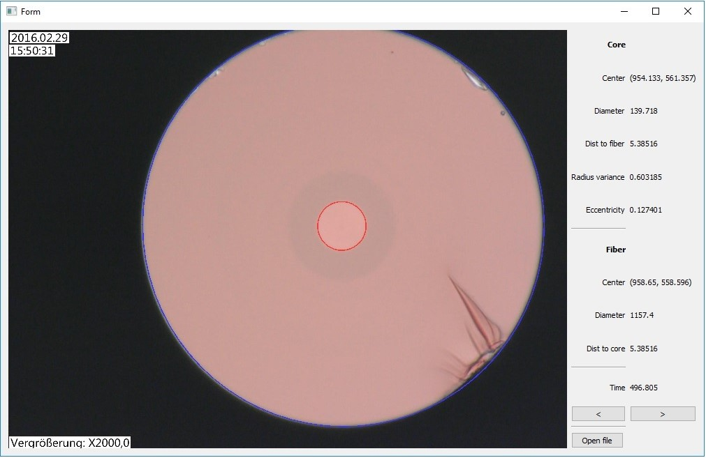
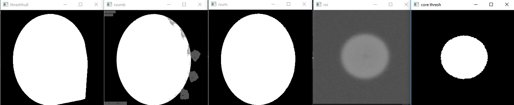

# cvutil
### Example

## Algorithm briefly

1. Get peaks on histogram
  2. Get binary threshold with darkest peak
  3. Get convex hull from threshold
  4. Distance transform on that hull and get location of brightest pixel (assume this is center)
  5. Rotate image 3 times around center and get average image (sum & divide it by 3 and threshold with ~.6 (where 2 of 3 rotations are white)
  6. convex hull on that and fit ellipse
  7. finding core is trivial to explain
